# 🎓 A MERN Stack Application

 full-stack MERN (MongoDB, Express.js, React.js, Node.js) application deployed on AWS infrastructure with high availability and load balancing. The project demonstrates enterprise-level deployment practices using EC2 instances, MongoDB Atlas, Nginx, and AWS Load Balancers.

## 🏗️ Architecture Overview

```
                        ┌────────────────────────────┐
                        │     Users / Clients        │
                        └────────────┬───────────────┘
                                     │
                                     ▼
                        ┌────────────────────────────┐
                        │   Cloudflare / DNS         │
                        └────────────┬───────────────┘
                                     │
                                     ▼
                        ┌────────────────────────────┐
                        │   Load Balancer (AWS ELB)  │
                        └────────────┬───────────────┘
                                     │
              ┌──────────────────────┴──────────────────────┐
              │                                             │
              ▼                                             ▼
  ┌────────────────────┐                       ┌────────────────────┐
  │  Backend Server 1   │                       │  Backend Server 2   │
  │  Node.js + Express  │                       │  Node.js + Express  │
  │     (EC2)          │                       │     (EC2)          │
  └─────────┬───────────┘                       └─────────┬───────────┘
            │                                              │
            └──────────────────┬───────────────────────────┘
                               │
                               ▼
                  ┌────────────────────────────┐
                  │     MongoDB Atlas          │
                  │   (Cloud Database)         │
                  └────────────────────────────┘
 
              ┌────────────────────────────┐
              │   Frontend Server 1        │
              │   React.js + Nginx         │
              │     (EC2)                  │
              └────────────────────────────┘
                           │
                           ▼
              ┌────────────────────────────┐
              │   Frontend Server 2        │
              │   React.js + Nginx         │
              │     (EC2)                  │
              └────────────────────────────┘
```

## 📁 Project Structure

```
Assignment-Hero/
├── backend/
│   ├── server.js
│   ├── routes/
│   ├── models/
│   └── package.json
├── frontend/
│   ├── src/
│   ├── public/
│   └── package.json
└── README.md
```

## 🚀 Deployment Architecture

### Infrastructure Components

- **EC2 Instances**: 4 instances (2 for backend, 2 for frontend)
- **Database**: MongoDB Atlas (Cloud-hosted)
- **Web Server**: Nginx (for frontend serving and reverse proxy)
- **Load Balancer**: AWS Elastic Load Balancer (ELB)
- **DNS**: Cloudflare

### High Availability Features

✔ Multiple backend servers for redundancy
✔ Multiple frontend servers for load distribution
✔ MongoDB Atlas with built-in replication
✔ Load balancer for automatic traffic distribution
✔ Nginx for efficient static file serving

## 🛠️ Prerequisites & Setup

### Required Tools

- AWS Account with EC2 access
- MongoDB Atlas account
- Node.js (v14 or higher)
- npm or yarn
- Git
- MongoDB Compass (optional, for database management)

## 📋 Step-by-Step Deployment Guide

### 1. Create EC2 Instances

Create 4 EC2 instances on AWS:
- 2 instances for backend servers
- 2 instances for frontend servers

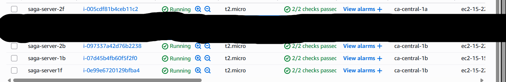

### 2. Connect to EC2 Instances

SSH into each instance using your IP:

```bash
ssh -i your-key.pem ec2-user@your-instance-ip
```


### 3. Setup MongoDB Atlas

**Create Cluster:**
- Sign up for MongoDB Atlas
- Create a new cluster
- Note down the connection string

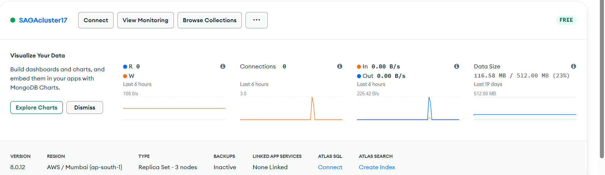

**Create Database User:**
- Navigate to Database Access
- Create a new database user with credentials

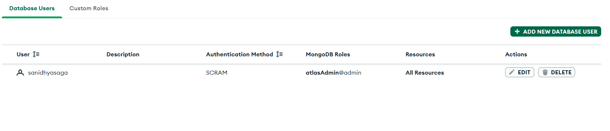

**Configure Network Access:**
- Add IP addresses of your EC2 instances
- Or allow access from anywhere (0.0.0.0/0) for testing

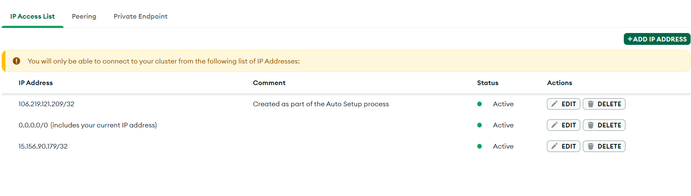

**Install MongoDB Compass:**
- Download and install MongoDB Compass
- Connect using your connection string
- Verify database connectivity

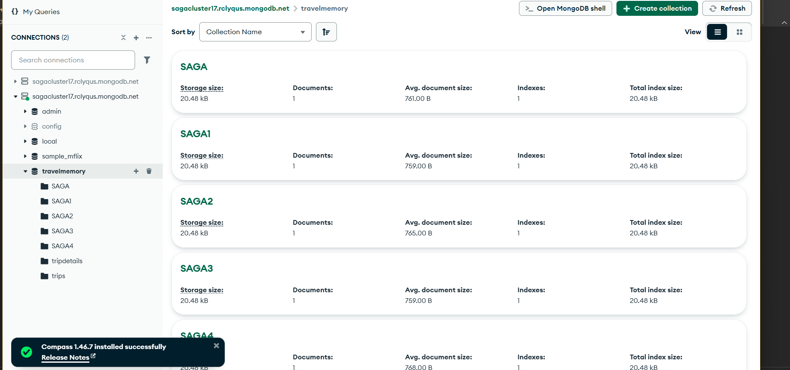

**Make Entries from Frontend:**

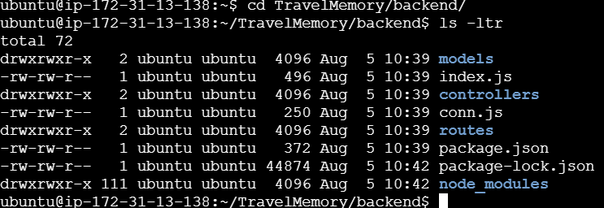

### 4. Configure Backend Servers

On both backend EC2 instances:

```bash
# Clone the repository
git clone <your-repo-url>
cd backend

# Install dependencies
npm install

# Configure environment variables
nano .env
# Add MongoDB connection string and other configs

# Start the backend server
npm start
```

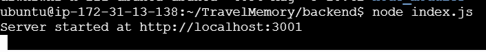

### 5. Test Backend

Test the backend API endpoints:

```bash
curl http://localhost:5000/api/health
```

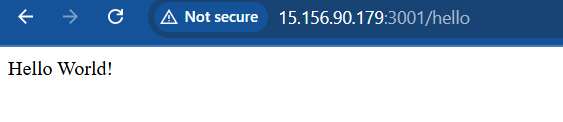

**Web Browser Test:**

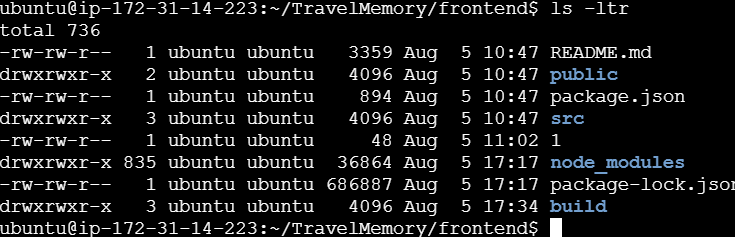

### 6. Configure Frontend Servers

On both frontend EC2 instances:

```bash
# Clone the repository
git clone <your-repo-url>
cd frontend

# Install dependencies
npm install

# Build the production version
npm run build

# The build folder will be served by Nginx
```

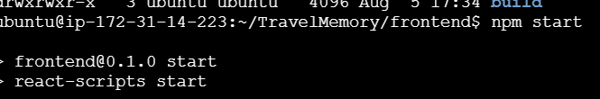

### 7. Verify Frontend Connection

Check if frontend is connecting to backend:

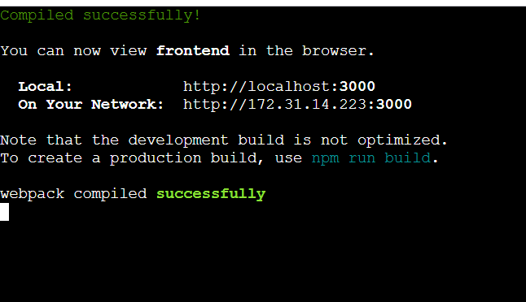

**Web Browser Test:**

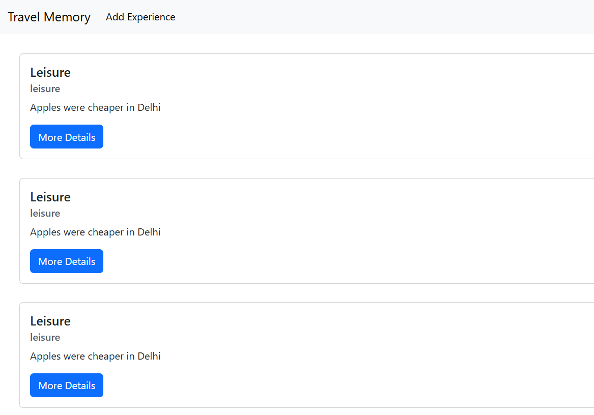

### 8. Setup Nginx

Install and configure Nginx on frontend servers:

```bash
# Install Nginx
sudo yum install nginx -y

# Configure Nginx
sudo nano /etc/nginx/nginx.conf
```

**Nginx Configuration:**

```nginx
server {
    listen 80;
    server_name your-domain.com;

    root /path/to/frontend/build;
    index index.html;

    location / {
        try_files $uri /index.html;
    }

    location /api {
        proxy_pass http://backend-load-balancer-url;
        proxy_http_version 1.1;
        proxy_set_header Upgrade $http_upgrade;
        proxy_set_header Connection 'upgrade';
        proxy_set_header Host $host;
        proxy_cache_bypass $http_upgrade;
    }
}
```

```bash
# Start Nginx
sudo systemctl start nginx
sudo systemctl enable nginx
```

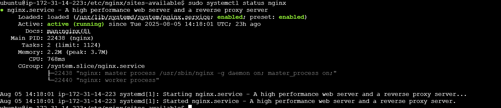

### 9. Create Load Balancers

**Backend Load Balancer:**
- Create Application Load Balancer in AWS
- Add both backend EC2 instances as targets
- Configure health checks

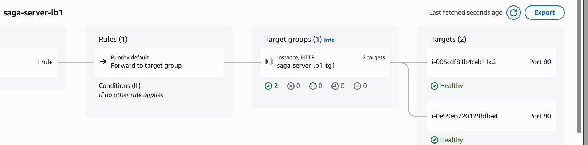

**Frontend Load Balancer:**
- Create Application Load Balancer for frontend
- Add both frontend EC2 instances as targets
- Configure health checks

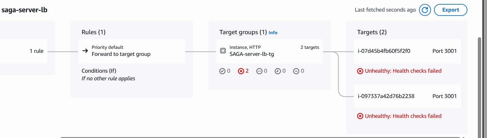

### 10. Configure Cloudflare (Optional)

- Add your domain to Cloudflare
- Point DNS records to your load balancers
- Enable SSL/TLS encryption

## 🎯 Features

- User authentication and authorization
- Assignment submission and management
- Real-time updates
- Responsive design
- High availability deployment
- Load balanced architecture

## 📸 Screenshots

All screenshots are included in the step-by-step guide above, showing the complete deployment process from EC2 setup to load balancer configuration.

## 🔧 Troubleshooting

### Common Issues

**Backend not connecting to MongoDB:**
- Check MongoDB Atlas network access settings
- Verify connection string in .env file
- Ensure database user has proper permissions

**Frontend not loading:**
- Check Nginx configuration
- Verify build folder path
- Check EC2 security group rules (port 80/443)

**Load balancer health checks failing:**
- Verify target instances are running
- Check security group rules
- Ensure health check path is correct

## 📝 Additional Notes

- Always use environment variables for sensitive data
- Keep your EC2 security groups properly configured
- Regularly backup your MongoDB database
- Monitor your AWS resources for cost optimization
- Use HTTPS in production with SSL certificates

## 👨‍💻 Author

**Your Name**
- GitHub: [@yourusername](https://github.com/yourusername)
- Email: your.email@example.com

## 📄 License

This project is licensed under the MIT License.

---

**Note:** Replace all placeholder images paths with actual screenshots from your deployment. Create a `screenshots` folder in your project root and add all relevant images there.
